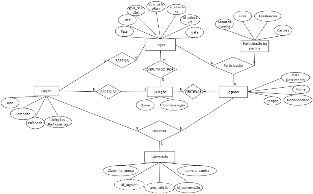


# **Documento de Especificação e Projeto de Banco de Dados**

Título do Projeto: Sistema de Futebol da Copa do Mundo

Disciplina: Banco de dados

Professor(a): Cássio Leonardo Rodrigues

Autores:

João Gabriel Abreu Soares - 202302553

Ícaro Pereira Rosa Alves de Sá - 202302547

### **Controle de Versão**

|Versão|Data|Autor(es)|` `Descrição da Alteração.|
| :- | :- | :- | :- |
|1\.0|` `26/08|Ícaro Pereira|Versão inicial do documento.|
|1\.1|06/10|João Gabriel|Adicionando diagrama MER e dicionário de dados em formato de lista.|
|1\.2|10/11|Ícaro Pereira|Adicionando comandos SQL de criação das tabelas.|
|1\.3|30/11|Ícaro Pereira|Inserindo Mapeamento para o Modelo Relacional.|
|1\.4|02/12|João Gabriel|Inserindo diagrama MER atualizado e a conclusão com referências.|

### **Sumário**

1. Introdução\
   1.1. Contexto e Objetivo do Projeto\
   1.2. Escopo
1. Requisitos de Dados\
   2.1. Requisitos Funcionais\
   2.2. Requisitos Não-Funcionais\
   2.2.1. Integridade da Entidade\
   2.2.2. Integridade Referencial\
   2.2.3. Integridade de Domínio\
   2.2.4. Integridade Definida pelo Usuário
1. Projeto Conceitual\
   3.1. Modelo Entidade-Relacionamento (MER)\
   3.2. Dicionário de Dados
1. Projeto Lógico\
   4.1. Mapeamento para o Modelo Relacional\
   4.2. Normalização
1. Implementação\
   5.1. Scripts SQL de Criação (DDL)\
   5.2. Scripts SQL de Manipulação e Consulta (DML/DQL)
1. Conclusão\
   6.1. Considerações Finais
1. Referências

### **1. Introdução**
####
#### **1.1. Contexto e Objetivo do Projeto**
O presente projeto tem como objetivo descrever e especificar os requisitos de dados para o "Sistema de Futebol da Copa do Mundo". O propósito fundamental é registrar e organizar de forma estruturada as informações históricas das edições da Copa do Mundo da FIFA. O sistema se concentrará em dados relativos a jogadores, seleções, jogos e seus respectivos resultados, permitindo análises detalhadas sobre a história da competição. Feito No PostgreeSQL Server.
#### **1.2. Escopo**

O escopo do sistema abrange o registro histórico de jogos de edições anteriores da Copa do Mundo. Isso inclui:

- O cadastro de edições do torneio, seleções participantes, e jogadores.
- O registro de todos os jogos, com informações de fase, placar, local e data.
- A capacidade de vincular jogadores a jogos para registrar seu desempenho individual (gols, assistências, etc.).
- A geração de relatórios e a derivação de informações consolidadas, como a idade de um jogador em uma partida ou o desempenho de uma seleção em uma edição específica.

### **
### **2. Requisitos de Dados**

#### **2.1. Requisitos Funcionais**
As funcionalidades do sistema que interagem com o banco de dados são as seguintes:

1. **Gerenciamento de Edições e Seleções:**
   1. O sistema deve permitir o cadastro de cada edição da Copa do Mundo, registrando o ano e o país-sede.
   1. Para cada edição, deve ser possível registrar as seleções participantes, incluindo seu nome e a confederação a que pertencem. Uma mesma seleção pode participar de múltiplas edições.
1. **Gerenciamento de Jogadores:**
   1. O sistema deve permitir o cadastro de jogadores, com nome, data de nascimento, nacionalidade, posição e clube em que atuava.
   1. O nome completo e a data de nascimento são suficientes para identificar um jogador de forma única.
   1. A idade do jogador não será armazenada diretamente, mas deve ser calculável a partir de sua data de nascimento.
1. **Registro de Jogos e Participações:**
   1. O sistema deve registrar cada jogo de uma edição, com dados como fase, local, placar e data.
   1. Cada jogo deve estar associado a duas seleções participantes e a uma edição da Copa do Mundo.
   1. A participação de um jogador em um jogo deve ser registrada, incluindo detalhes como gols, assistências, minutos jogados e cartões.
1. **Relatórios e Análise:**
   1. Gerar relatórios que mostrem a média de gols por jogo de uma edição específica.
   1. Listar os 10 jogadores com mais gols e mais assistências em uma única edição.
   1. Calcular o número total de cartões amarelos e vermelhos por confederação.
   1. Gerar um relatório listando todos os jogos de mata-mata que terminaram em empate no tempo normal e o resultado final da partida.
   1. Mostrar quantos jogadores de uma determinada idade participaram de uma edição específica.
   1. Listar os jogadores que participaram de todas as edições da Copa entre dois anos.
####
####
####
#### **2.2. Requisitos Não-Funcionais**

##### **2.2.1. Integridade da Entidade**
- Cada edição da Copa do Mundo deve ser única, identificada pelo seu ano e país-sede.
- A combinação do nome completo e da data de nascimento de um jogador deve ser única no sistema.
- Cada jogo deve possuir um identificador único dentro de uma edição específica do torneio.
##### **2.2.2. Integridade Referencial**

- Um jogo só poderá ser registrado se as duas seleções participantes e a edição da Copa do Mundo correspondente já estiverem cadastradas.
- A participação de um jogador em um jogo só pode ser registrada se tanto o jogador quanto o jogo já existirem no banco de dados.
- A exclusão de uma edição da Copa do Mundo implicará na exclusão de todos os jogos e participações de jogadores associados a ela.
##### **2.2.3. Integridade de Domínio**
- O ano de uma edição da Copa do Mundo deve ser um número inteiro.
- O placar de um jogo deve ser representado por números inteiros não negativos.
- As datas (nascimento e jogo) devem ser válidas, e a data de nascimento de um jogador deve ser sempre anterior à data de um jogo do qual ele participou.
##### **2.2.4. Integridade Definida pelo Usuário**
- Um jogador só pode ser associado a uma seleção em uma edição se ele possuir a mesma nacionalidade da seleção.
- Um jogo só pode ser registrado se as duas seleções participantes forem distintas.
- O campeão de uma edição da Copa do Mundo deve ser, obrigatoriamente, uma das seleções que participaram daquela edição

### **3. Projeto Conceitual**

#### **3.1. Modelo Entidade-Relacionamento (MER)**

#### **3.2. Dicionário de Dados**
### **Entidade: Edição**
- **Ano:**
  - *Descrição:* Ano de realização da edição do torneio.
  - *Tipo de Dado:* Inteiro / Ano
- **Campeao:**
  - *Descrição:* Nome da seleção que venceu a edição.

*Tipo de Dado:* Texto

- **Pais Sede:**
  - *Descrição:* Nome do país que sediou o torneio.
  - *Tipo de Dado:* Texto
- **Seleções\_Participantes:**
  - *Descrição:* Número total de seleções que participaram da edição.
  - *Tipo de Dado:* Inteiro
### **Entidade: Jogos**
- **id\_jogo (Chave Primária):**
  - *Descrição:* Identificador único para cada jogo. (Inferido pela necessidade de uma chave)
  - *Tipo de Dado:* Inteiro / Autoincremento
- **data:**
  - *Descrição:* Data em que o jogo foi realizado.
  - *Tipo de Dado:* Data
- **Fase:**
  - *Descrição:* Fase do torneio a que o jogo pertence (ex: Fase de Grupos, Oitavas de Final).
  - *Tipo de Dado:* Texto
- **Local:**
  - *Descrição:* Estádio ou cidade onde o jogo foi disputado.
  - *Tipo de Dado:* Texto
- **id\_selecao1 (Chave Estrangeira):**
  - *Descrição:* Identificador da primeira seleção que disputou o jogo.
  - *Tipo de Dado:* Inteiro
- **id\_selecao2 (Chave Estrangeira):**
  - *Descrição:* Identificador da segunda seleção que disputou o jogo.
  - *Tipo de Dado:* Inteiro
- **gols\_selecao1:**
  - *Descrição:* Número de gols marcados pela primeira seleção.
  - *Tipo de Dado:* Inteiro
- **gols\_selecao2:**
  - *Descrição:* Número de gols marcados pela segunda seleção.
  - *Tipo de Dado:* Inteiro
- **Ano\_edicao** **(Chave Estrangeira):**
  - *Descrição:* Ano da edição da Copa em que o jogo ocorreu.
  - *Tipo de Dado:* Inteiro
### **Entidade: Seleção**
- **id\_selecao (Chave Primária):**
  - *Descrição:* Identificador único para cada seleção. (Inferido pela necessidade de uma chave)
  - *Tipo de Dado:* Inteiro / Autoincremento
- **Nome:**
  - *Descrição:* Nome da seleção (país).
  - *Tipo de Dado:* Texto
- **Confederação:**
  - *Descrição:* Confederação à qual a seleção pertence (ex: CONMEBOL, UEFA).
  - *Tipo de Dado:* Texto

### **Entidade: Jogador**
- **id\_jogador (Chave Primária):**
  - *Descrição:* Identificador único para cada jogador. (Inferido pela necessidade de uma chave)
  - *Tipo de Dado:* Inteiro / Autoincremento
- **nome:**
  - *Descrição:* Nome completo do jogador.
  - *Tipo de Dado:* Texto
- **data\_nascimento:**
  - *Descrição:* Data de nascimento do jogador.
  - *Tipo de Dado:* Data
- **posicao:**
  - *Descrição:* Posição principal em que o jogador atua (ex: Atacante, Goleiro).
  - *Tipo de Dado:* Texto
- **nacionalidade:**
  - *Descrição:* Nacionalidade do jogador.
  - *Tipo de Dado:* Texto
- **id\_selecao (Chave Estrangeira):**
  - *Descrição:* Identificador da seleção à qual o jogador pertence.
  - *Tipo de Dado:* Inteiro
### **Entidade Associativa: Participação**
Esta entidade é formada pela relação N:N entre Jogador e Jogos.

- **id\_jogo (Chave Estrangeira):**
  - *Descrição:* Identificador do jogo em que o jogador participou.
  - *Tipo de Dado:* Inteiro
- **id\_jogador (Chave Estrangeira):**
  - *Descrição:* Identificador do jogador que participou do jogo.
  - *Tipo de Dado:* Inteiro
- **minutos\_jogados:**
  - *Descrição:* Quantidade de minutos que o jogador esteve em campo.
  - *Tipo de Dado:* Inteiro
- **gols:**
  - *Descrição:* Número de gols marcados pelo jogador na partida.
  - *Tipo de Dado:* Inteiro
- **assistencias:**
  - *Descrição:* Número de assistências para gol feitas pelo jogador na partida.
  - *Tipo de Dado:* Inteiro
- **cartoes:**
  - *Descrição:* Cartões recebidos pelo jogador (ex: Amarelo, Vermelho).
  - *Tipo de Dado:* Texto / Inteiro (codificado)

### **Entidade Associativa: Convocação**
Esta entidade é formada pela relação N:N entre **Jogador e Edição**.

- **id\_convocacao (Chave Primária):**
  - *Descrição:* Identificador único do registro de convocação.
  - *Tipo de Dado:* Inteiro / Autoincremento
- **id\_jogador (Chave Estrangeira):**
  - *Descrição:* Identificador do jogador que participou do jogo.
  - *Tipo de Dado:* Inteiro
- **ano\_edicao:**
  - *Descrição:* Ano da edição da Copa para a qual o jogador foi convocado.
  - *Tipo de Dado:* Inteiro
- **clube\_na\_epoca:**
  - *Descrição:* Clube onde o jogador atuava na época desta edição específica.
  - *Tipo de Dado:* Texto
- **numero\_camisa:**
  - *Descrição:* Número da camisa utilizada pelo jogador nesta edição específica..
  - *Tipo de Dado:* Inteiro
### **Entidade Associativa: Participação Seleção**
É a entidade é formada pela relação N:N entre **Edição e Seleção**.

- **Ano\_edicao (Chave Estrangeira):**
  - *Descrição:* Ano da edição do torneio.
  - *Tipo de Dado:* Inteiro
- **id\_selecao (Chave Estrangeira):**
  - *Descrição:* Identificador da seleção que participou daquela edição.
  - *Tipo de Dado:* Inteiro
### **4. Projeto Lógico**

#### **4.1. Mapeamento para o Modelo Relacional**

#### **4.2. Normalização**
A normalização é o processo de organização dos dados em um banco de dados com o objetivo de reduzir a redundância e garantir a integridade das informações. Neste projeto, o esquema relacional foi refinado para atender às três primeiras formas normais (1FN, 2FN e 3FN), conforme detalhado a seguir:

**1. Primeira Forma Normal (1FN): Atomicidade e Valores Únicos** A 1FN estabelece que todos os atributos de uma tabela devem conter valores atômicos (indivisíveis) e que não devem existir grupos de valores repetidos.

- **Aplicação no Projeto:** Para evitar o armazenamento de múltiplos valores em uma única célula (como uma lista de jogos em que um jogador atuou), utilizamos tabelas associativas. A criação das tabelas **Participacao** e **Participacao\_Selecao** garante que cada registro seja único e atômico, eliminando grupos de repetição e facilitando consultas SQL.

**2. Segunda Forma Normal (2FN): Dependência Funcional Total** A 2FN exige que a tabela esteja na 1FN e que os atributos não-chave dependam de **toda** a chave primária (e não apenas de uma parte dela). Esta regra é crítica para tabelas com chaves compostas.

- **Aplicação no Projeto:** Na tabela **Participacao**, a chave primária é composta por id\_jogo e id\_jogador. Os atributos como gols, assistencias e cartoes dependem exclusivamente dessa combinação (o desempenho daquele jogador naquela partida específica). Não incluímos dados como "Nome do Jogador" nesta tabela, pois isso dependeria apenas de uma parte da chave (id\_jogador), o que violaria a 2FN e geraria redundância.

**3. Terceira Forma Normal (3FN): Dependência Transitiva e Histórico** A 3FN exige que a tabela esteja na 2FN e que não existam dependências transitivas (um atributo não-chave dependendo de outro atributo não-chave). Todos os campos devem depender diretamente da chave primária.

- **Aplicação no Projeto:** Esta regra motivou a reestruturação da entidade **Jogador**. Inicialmente, atributos como Clube e Número da Camisa poderiam pertencer à tabela de jogadores. No entanto, esses dados são voláteis e dependem do contexto temporal (a Edição da Copa).
- **Solução:** Criamos a tabela **Convocacao**. Movemos os atributos variáveis (clube\_na\_epoca, numero\_camisa) para ela. Assim, a tabela Jogador mantém apenas dados imutáveis (Nome, Data de Nascimento), enquanto a Convocacao armazena o histórico do atleta em cada ano, garantindo a integridade histórica e eliminando anomalias de atualização.

### **5. Implementação**

#### **5.1. Scripts SQL de Criação (DDL)**
SQL

CREATE TABLE edicao (

`    `ano INTEGER NOT NULL,

`    `pais\_sede VARCHAR(100),

`    `campeao VARCHAR(100),

`    `selecoes\_participantes INTEGER,

`    `CONSTRAINT edicao\_pkey PRIMARY KEY (ano)

);

CREATE TABLE selecao (

`    `id\_selecao SERIAL NOT NULL,

`    `nome VARCHAR(100) NOT NULL,

`    `confederacao VARCHAR(50),

`    `CONSTRAINT selecao\_pkey PRIMARY KEY (id\_selecao)

); 

CREATE TABLE jogador (

`    `id\_jogador SERIAL NOT NULL,

`    `nome VARCHAR(150) NOT NULL,

`    `data\_nascimento DATE,

`    `posicao VARCHAR(50),

`    `nacionalidade VARCHAR(100),

`    `id\_selecao INTEGER,

`    `CONSTRAINT jogador\_pkey PRIMARY KEY (id\_jogador),

`    `CONSTRAINT jogador\_id\_selecao\_fkey FOREIGN KEY (id\_selecao)

`        `REFERENCES public.selecao (id\_selecao)

); 

CREATE TABLE jogos (

`    `id\_jogo SERIAL NOT NULL,

`    `data\_jogo DATE,

`    `fase VARCHAR(50),

`    `local\_jogo VARCHAR(100),

`    `gols\_selecao1 INTEGER,

`    `gols\_selecao2 INTEGER,

`    `id\_selecao1 INTEGER,

`    `id\_selecao2 INTEGER,

`    `ano\_edicao INTEGER,

`    `CONSTRAINT jogos\_pkey PRIMARY KEY (id\_jogo),

`    `CONSTRAINT jogos\_id\_selecao1\_fkey FOREIGN KEY (id\_selecao1)

`        `REFERENCES public.selecao (id\_selecao),

`    `CONSTRAINT jogos\_id\_selecao2\_fkey FOREIGN KEY (id\_selecao2)

`        `REFERENCES public.selecao (id\_selecao),

`    `CONSTRAINT jogos\_ano\_edicao\_fkey FOREIGN KEY (ano\_edicao)

`        `REFERENCES public.edicao (ano)

); 

CREATE TABLE participacao (

`    `id\_jogo INTEGER NOT NULL,

`    `id\_jogador INTEGER NOT NULL,

`    `minutos\_jogados INTEGER,

`    `gols INTEGER DEFAULT 0,

`    `assistencias INTEGER DEFAULT 0,

`    `cartoes VARCHAR(50),

`    `CONSTRAINT participacao\_pkey PRIMARY KEY (id\_jogo, id\_jogador),

`    `CONSTRAINT participacao\_id\_jogo\_fkey FOREIGN KEY (id\_jogo)

`        `REFERENCES public.jogos (id\_jogo),

`    `CONSTRAINT participacao\_id\_jogador\_fkey FOREIGN KEY (id\_jogador)

`        `REFERENCES public.jogador (id\_jogador)

); 

CREATE TABLE convocacao (

`    `id\_convocacao SERIAL PRIMARY KEY,

`    `id\_jogador INTEGER NOT NULL,

`    `ano\_edicao INTEGER NOT NULL,

`    `clube\_na\_epoca VARCHAR(100),

`    `numero\_camisa INTEGER,

`    `CONSTRAINT convocacao\_id\_jogador\_fkey FOREIGN KEY (id\_jogador)

`        `REFERENCES public.jogador (id\_jogador),

`    `CONSTRAINT convocacao\_ano\_edicao\_fkey FOREIGN KEY (ano\_edicao)

`        `REFERENCES public.edicao (ano),

`    `CONSTRAINT unique\_jogador\_edicao UNIQUE (id\_jogador, ano\_edicao)

); 

CREATE TABLE participacao\_selecao (

`    `ano\_edicao INTEGER NOT NULL,

`    `id\_selecao INTEGER NOT NULL,

`    `CONSTRAINT participacao\_selecao\_pkey PRIMARY KEY (ano\_edicao, id\_selecao),

`    `CONSTRAINT participacao\_selecao\_ano\_fkey FOREIGN KEY (ano\_edicao)

`        `REFERENCES public.edicao (ano),

`    `CONSTRAINT participacao\_selecao\_id\_selecao\_fkey FOREIGN KEY (id\_selecao)

`        `REFERENCES public.selecao (id\_selecao)

);

#### **5.2. Scripts SQL de Manipulação e Consulta (DML/DQL)**
**A. Script de População de Dados (INSERT)**

SQL

\-----------------------------------------------------------------------------------

-- 1. LIMPEZA TOTAL (Garante que começamos do zero para evitar conflitos)

\-----------------------------------------------------------------------------------

TRUNCATE TABLE public.participacao, public.convocacao, public.participacao\_selecao, public.jogos, public.jogador, public.selecao, public.edicao RESTART IDENTITY CASCADE;

\-----------------------------------------------------------------------------------

-- 2. CADASTRO DE EDIÇÕES E SELEÇÕES

\-----------------------------------------------------------------------------------

-- Edições

INSERT INTO public.edicao (ano, pais\_sede, campeao, selecoes\_participantes) VALUES

(1970, 'México', 'Brasil', 16),

(2002, 'Coreia do Sul e Japão', 'Brasil', 32),

(2022, 'Qatar', 'Argentina', 32);

-- Seleções (Todas de 1970 + As de 2002/2022)

INSERT INTO public.selecao (nome, confederacao) VALUES

-- Seleções de 1970

('Brasil', 'CONMEBOL'), ('Inglaterra', 'UEFA'), ('Romênia', 'UEFA'), ('Tchecoslováquia', 'UEFA'),

('União Soviética', 'UEFA'), ('México', 'CONCACAF'), ('Bélgica', 'UEFA'), ('El Salvador', 'CONCACAF'),

('Itália', 'UEFA'), ('Uruguai', 'CONMEBOL'), ('Suécia', 'UEFA'), ('Israel', 'AFC'),

('Alemanha', 'UEFA'), ('Peru', 'CONMEBOL'), ('Bulgária', 'UEFA'), ('Marrocos', 'CAF'),

-- Extras de 2002/2022

('França', 'UEFA'), ('Argentina', 'CONMEBOL');

-- Vincular Seleções às Edições

INSERT INTO public.participacao\_selecao (ano\_edicao, id\_selecao)

SELECT 1970, id\_selecao FROM public.selecao WHERE nome IN ('Brasil', 'Inglaterra', 'Romênia', 'Tchecoslováquia', 'União Soviética', 'México', 'Bélgica', 'El Salvador', 'Itália', 'Uruguai', 'Suécia', 'Israel', 'Alemanha', 'Peru', 'Bulgária', 'Marrocos');

INSERT INTO public.participacao\_selecao (ano\_edicao, id\_selecao) VALUES

(2002, (SELECT id\_selecao FROM public.selecao WHERE nome = 'Brasil')),

(2002, (SELECT id\_selecao FROM public.selecao WHERE nome = 'Alemanha')),

(2022, (SELECT id\_selecao FROM public.selecao WHERE nome = 'Argentina')),

(2022, (SELECT id\_selecao FROM public.selecao WHERE nome = 'França'));

\-----------------------------------------------------------------------------------

-- 3. CADASTRO DE JOGADORES

\-----------------------------------------------------------------------------------

INSERT INTO public.jogador (nome, data\_nascimento, posicao, nacionalidade, id\_selecao) VALUES

-- 1970 (Brasil e Estrelas)

('Pelé', '1940-10-23', 'Atacante', 'Brasil', (SELECT id\_selecao FROM public.selecao WHERE nome='Brasil')),

('Jairzinho', '1944-12-25', 'Atacante', 'Brasil', (SELECT id\_selecao FROM public.selecao WHERE nome='Brasil')),

('Tostão', '1947-01-25', 'Atacante', 'Brasil', (SELECT id\_selecao FROM public.selecao WHERE nome='Brasil')),

('Rivelino', '1946-01-01', 'Meia', 'Brasil', (SELECT id\_selecao FROM public.selecao WHERE nome='Brasil')),

('Gérson', '1941-01-11', 'Meia', 'Brasil', (SELECT id\_selecao FROM public.selecao WHERE nome='Brasil')),

('Carlos Alberto Torres', '1944-07-17', 'Lateral', 'Brasil', (SELECT id\_selecao FROM public.selecao WHERE nome='Brasil')),

('Clodoaldo', '1949-09-25', 'Meia', 'Brasil', (SELECT id\_selecao FROM public.selecao WHERE nome='Brasil')),

('Gerd Müller', '1945-11-03', 'Atacante', 'Alemanha', (SELECT id\_selecao FROM public.selecao WHERE nome='Alemanha')),

('Teófilo Cubillas', '1949-03-08', 'Meia', 'Peru', (SELECT id\_selecao FROM public.selecao WHERE nome='Peru')),

('Luigi Riva', '1944-11-07', 'Atacante', 'Itália', (SELECT id\_selecao FROM public.selecao WHERE nome='Itália')),

-- 2002

('Ronaldo Nazário', '1976-09-18', 'Atacante', 'Brasil', (SELECT id\_selecao FROM public.selecao WHERE nome='Brasil')),

('Oliver Kahn', '1969-06-15', 'Goleiro', 'Alemanha', (SELECT id\_selecao FROM public.selecao WHERE nome='Alemanha')),

-- 2022

('Lionel Messi', '1987-06-24', 'Atacante', 'Argentina', (SELECT id\_selecao FROM public.selecao WHERE nome='Argentina')),

('Kylian Mbappé', '1998-12-20', 'Atacante', 'França', (SELECT id\_selecao FROM public.selecao WHERE nome='França'));

\-----------------------------------------------------------------------------------

-- 4. CONVOCAÇÃO

\-----------------------------------------------------------------------------------

INSERT INTO public.convocacao (id\_jogador, ano\_edicao, clube\_na\_epoca, numero\_camisa) VALUES

-- 1970

((SELECT id\_jogador FROM public.jogador WHERE nome='Pelé'), 1970, 'Santos', 10),

((SELECT id\_jogador FROM public.jogador WHERE nome='Jairzinho'), 1970, 'Botafogo', 7),

((SELECT id\_jogador FROM public.jogador WHERE nome='Tostão'), 1970, 'Cruzeiro', 9),

((SELECT id\_jogador FROM public.jogador WHERE nome='Rivelino'), 1970, 'Corinthians', 11),

((SELECT id\_jogador FROM public.jogador WHERE nome='Gérson'), 1970, 'São Paulo', 8),

((SELECT id\_jogador FROM public.jogador WHERE nome='Carlos Alberto Torres'), 1970, 'Santos', 4),

((SELECT id\_jogador FROM public.jogador WHERE nome='Gerd Müller'), 1970, 'Bayern de Munique', 13),

((SELECT id\_jogador FROM public.jogador WHERE nome='Teófilo Cubillas'), 1970, 'Alianza Lima', 10),

-- 2002

((SELECT id\_jogador FROM public.jogador WHERE nome='Ronaldo Nazário'), 2002, 'Inter de Milão', 9),

((SELECT id\_jogador FROM public.jogador WHERE nome='Oliver Kahn'), 2002, 'Bayern de Munique', 1),

-- 2022

((SELECT id\_jogador FROM public.jogador WHERE nome='Lionel Messi'), 2022, 'PSG', 10),

((SELECT id\_jogador FROM public.jogador WHERE nome='Kylian Mbappé'), 2022, 'PSG', 10);

\-----------------------------------------------------------------------------------

-- 5. JOGOS (Inserção de TODOS os jogos de 1970)

\-----------------------------------------------------------------------------------

INSERT INTO public.jogos (data\_jogo, fase, local\_jogo, gols\_selecao1, gols\_selecao2, id\_selecao1, id\_selecao2, ano\_edicao) VALUES

-- COPA 1970: FASE DE GRUPOS (Brasil no Grupo 3)

('1970-06-03', 'Grupos', 'Guadalajara', 4, 1, (SELECT id\_selecao FROM public.selecao WHERE nome='Brasil'), (SELECT id\_selecao FROM public.selecao WHERE nome='Tchecoslováquia'), 1970),

('1970-06-07', 'Grupos', 'Guadalajara', 1, 0, (SELECT id\_selecao FROM public.selecao WHERE nome='Brasil'), (SELECT id\_selecao FROM public.selecao WHERE nome='Inglaterra'), 1970),

('1970-06-10', 'Grupos', 'Guadalajara', 3, 2, (SELECT id\_selecao FROM public.selecao WHERE nome='Brasil'), (SELECT id\_selecao FROM public.selecao WHERE nome='Romênia'), 1970),

-- Outros Jogos de 1970

('1970-06-03', 'Grupos', 'León', 2, 1, (SELECT id\_selecao FROM public.selecao WHERE nome='Alemanha'), (SELECT id\_selecao FROM public.selecao WHERE nome='Marrocos'), 1970),

('1970-06-07', 'Grupos', 'León', 5, 2, (SELECT id\_selecao FROM public.selecao WHERE nome='Alemanha'), (SELECT id\_selecao FROM public.selecao WHERE nome='Bulgária'), 1970),

('1970-06-10', 'Grupos', 'León', 3, 1, (SELECT id\_selecao FROM public.selecao WHERE nome='Alemanha'), (SELECT id\_selecao FROM public.selecao WHERE nome='Peru'), 1970),

-- COPA 1970: MATA-MATA

('1970-06-14', 'Quartas', 'Guadalajara', 4, 2, (SELECT id\_selecao FROM public.selecao WHERE nome='Brasil'), (SELECT id\_selecao FROM public.selecao WHERE nome='Peru'), 1970),

('1970-06-14', 'Quartas', 'León', 3, 2, (SELECT id\_selecao FROM public.selecao WHERE nome='Alemanha'), (SELECT id\_selecao FROM public.selecao WHERE nome='Inglaterra'), 1970),

('1970-06-17', 'Semifinal', 'Guadalajara', 3, 1, (SELECT id\_selecao FROM public.selecao WHERE nome='Brasil'), (SELECT id\_selecao FROM public.selecao WHERE nome='Uruguai'), 1970),

('1970-06-21', 'Final', 'Cidade do México', 4, 1, (SELECT id\_selecao FROM public.selecao WHERE nome='Brasil'), (SELECT id\_selecao FROM public.selecao WHERE nome='Itália'), 1970),

-- FINAIS HISTÓRICAS (2002 e 2022)

('2002-06-30', 'Final', 'Yokohama', 2, 0, (SELECT id\_selecao FROM public.selecao WHERE nome='Brasil'), (SELECT id\_selecao FROM public.selecao WHERE nome='Alemanha'), 2002),

('2022-12-18', 'Final', 'Lusail', 3, 3, (SELECT id\_selecao FROM public.selecao WHERE nome='Argentina'), (SELECT id\_selecao FROM public.selecao WHERE nome='França'), 2022);

\-----------------------------------------------------------------------------------

-- 6. ESTATÍSTICAS (PARTICIPAÇÃO)

-- CORREÇÃO: Filtramos também pelo 'id\_selecao1' = Brasil para garantir que o ID seja único

\-----------------------------------------------------------------------------------

INSERT INTO public.participacao (id\_jogo, id\_jogador, minutos\_jogados, gols, assistencias, cartoes) VALUES

-- 1970: Brasil 4x1 Tchecoslováquia (Adicionado filtro 'id\_selecao1' para evitar duplicidade)

((SELECT id\_jogo FROM public.jogos WHERE ano\_edicao=1970 AND id\_selecao1=(SELECT id\_selecao FROM public.selecao WHERE nome='Brasil') AND id\_selecao2=(SELECT id\_selecao FROM public.selecao WHERE nome='Tchecoslováquia')), (SELECT id\_jogador FROM public.jogador WHERE nome='Jairzinho'), 90, 2, 0, 'Nenhum'),

((SELECT id\_jogo FROM public.jogos WHERE ano\_edicao=1970 AND id\_selecao1=(SELECT id\_selecao FROM public.selecao WHERE nome='Brasil') AND id\_selecao2=(SELECT id\_selecao FROM public.selecao WHERE nome='Tchecoslováquia')), (SELECT id\_jogador FROM public.jogador WHERE nome='Pelé'), 90, 1, 0, 'Nenhum'),

-- 1970: Brasil 1x0 Inglaterra

((SELECT id\_jogo FROM public.jogos WHERE ano\_edicao=1970 AND id\_selecao1=(SELECT id\_selecao FROM public.selecao WHERE nome='Brasil') AND id\_selecao2=(SELECT id\_selecao FROM public.selecao WHERE nome='Inglaterra')), (SELECT id\_jogador FROM public.jogador WHERE nome='Jairzinho'), 90, 1, 0, 'Nenhum'),

-- 1970: Brasil 4x2 Peru (Quartas)

((SELECT id\_jogo FROM public.jogos WHERE ano\_edicao=1970 AND fase='Quartas' AND id\_selecao1=(SELECT id\_selecao FROM public.selecao WHERE nome='Brasil')), (SELECT id\_jogador FROM public.jogador WHERE nome='Tostão'), 90, 2, 1, 'Nenhum'),

((SELECT id\_jogo FROM public.jogos WHERE ano\_edicao=1970 AND fase='Quartas' AND id\_selecao2=(SELECT id\_selecao FROM public.selecao WHERE nome='Peru')), (SELECT id\_jogador FROM public.jogador WHERE nome='Teófilo Cubillas'), 90, 1, 0, 'Nenhum'),

-- 1970: Brasil 4x1 Itália (Final)

((SELECT id\_jogo FROM public.jogos WHERE ano\_edicao=1970 AND fase='Final'), (SELECT id\_jogador FROM public.jogador WHERE nome='Pelé'), 90, 1, 2, 'Nenhum'),

((SELECT id\_jogo FROM public.jogos WHERE ano\_edicao=1970 AND fase='Final'), (SELECT id\_jogador FROM public.jogador WHERE nome='Jairzinho'), 90, 1, 0, 'Nenhum'),

((SELECT id\_jogo FROM public.jogos WHERE ano\_edicao=1970 AND fase='Final'), (SELECT id\_jogador FROM public.jogador WHERE nome='Carlos Alberto Torres'), 90, 1, 0, 'Nenhum'),

-- 2002: Final

((SELECT id\_jogo FROM public.jogos WHERE ano\_edicao=2002), (SELECT id\_jogador FROM public.jogador WHERE nome='Ronaldo Nazário'), 85, 2, 0, 'Nenhum'),

-- 2022: Final

((SELECT id\_jogo FROM public.jogos WHERE ano\_edicao=2022), (SELECT id\_jogador FROM public.jogador WHERE nome='Kylian Mbappé'), 120, 3, 0, 'Nenhum'),

((SELECT id\_jogo FROM public.jogos WHERE ano\_edicao=2022), (SELECT id\_jogador FROM public.jogador WHERE nome='Lionel Messi'), 120, 2, 0, 'Nenhum');

**B. Consultas de Relatórios (SELECT)**

Abaixo estão as consultas que atendem aos Requisitos Funcionais definidos na seção 2.1.

**Consulta 1:** Média de gols por jogo de uma edição específica (Ex: 2022)

SQL

SELECT AVG(gols\_selecao1 + gols\_selecao2) AS media\_gols\_por\_jogo

FROM public.jogos

WHERE ano\_edicao = 2022;

**Consulta 2:** Top jogadores com mais gols e assistências em uma edição

SELECT 

`    `j.nome, 

`    `s.nome AS selecao,

`    `SUM(p.gols) AS total\_gols,

`    `SUM(p.assistencias) AS total\_assistencias

FROM public.participacao p

JOIN public.jogador j ON p.id\_jogador = j.id\_jogador

JOIN public.jogos g ON p.id\_jogo = g.id\_jogo

JOIN public.selecao s ON j.id\_selecao = s.id\_selecao

WHERE g.ano\_edicao = 2022

GROUP BY j.nome, s.nome

ORDER BY total\_gols DESC, total\_assistencias DESC

LIMIT 10;

**Consulta 3:** Total de cartões por Confederação

SELECT 

`    `s.confederacao,

`    `COUNT(p.cartoes) AS total\_cartoes

FROM public.participacao p

JOIN public.jogador j ON p.id\_jogador = j.id\_jogador

JOIN public.selecao s ON j.id\_selecao = s.id\_selecao

WHERE p.cartoes IN ('Amarelo', 'Vermelho')

GROUP BY s.confederacao;

**Consulta 4:** Jogos de Mata-mata que terminaram em empate

SELECT 

`    `g.fase,

`    `s1.nome AS time\_casa,

`    `g.gols\_selecao1,

`    `g.gols\_selecao2,

`    `s2.nome AS time\_fora,

`    `g.data\_jogo

FROM public.jogos g

JOIN public.selecao s1 ON g.id\_selecao1 = s1.id\_selecao

JOIN public.selecao s2 ON g.id\_selecao2 = s2.id\_selecao

WHERE g.fase != 'Grupos' 

`  `AND g.gols\_selecao1 = g.gols\_selecao2;

**Consulta 5:** Histórico do Jogador (Clube e Número na Época) demonstra a normalização aplicada na tabela Convocacao.

SELECT 

`    `j.nome, 

`    `g.ano\_edicao,

`    `c.clube\_na\_epoca, 

`    `c.numero\_camisa

FROM public.participacao p

JOIN public.jogador j ON p.id\_jogador = j.id\_jogador

JOIN public.jogos g ON p.id\_jogo = g.id\_jogo

JOIN public.convocacao c ON j.id\_jogador = c.id\_jogador AND g.ano\_edicao = c.ano\_edicao

ORDER BY j.nome, g.ano\_edicao;

### **6. Conclusão**
O desenvolvimento do banco de dados para o Sistema de Futebol da Copa do Mundo permitiu aplicar de forma prática conceitos fundamentais de modelagem de diagramas, normalização e implementação em SQL. O projeto consolidou a importância de estruturar corretamente entidades, relações e restrições para garantir integridade e consistência dos dados, especialmente em um domínio histórico e rico em informações como o das edições da Copa do Mundo.

Além disso, a construção dos scripts de criação, inserção e consulta reforçou a necessidade de um modelo lógico bem definido e estruturado, capaz de suportar análises reais e criação de scripts para automação de consultas para reduzir o tempo ao manusear o banco de dados, como desempenho de jogadores, estatísticas de jogos e participação das seleções ao longo dos anos.

#### **6.1. Considerações Finais**
A elaboração deste projeto proporcionou uma experiência completa, desde o levantamento dos requisitos até a implementação no PostgreSQL. Entre os principais aprendizados, destacam-se: a correta utilização de chaves estrangeiras, o uso de tabelas associativas para relações N:N, a aplicação prática das formas normais e o desenvolvimento de consultas SQL mais complexas. De forma geral, o sistema final atende ao objetivo proposto e demonstra a eficácia do modelo relacional para representar dados esportivos históricos de maneira organizada e confiável.

Aprendemos muito nessa experiência e sinto que ela foi edificante na nossa jornada acadêmica e profissional.
### **7. Referências**
Fontes de pesquisa:\
\
1 - <https://www.transfermarkt.com.br/>  (Site que mostra os clubes e dados de cada jogador referente aos anos).

2 - <https://www.fifa.com/pt> (Site Oficial da Federação Internacional de Futebol).

3- <http://ge.globo.com/> (Site do Globo Esporte)

