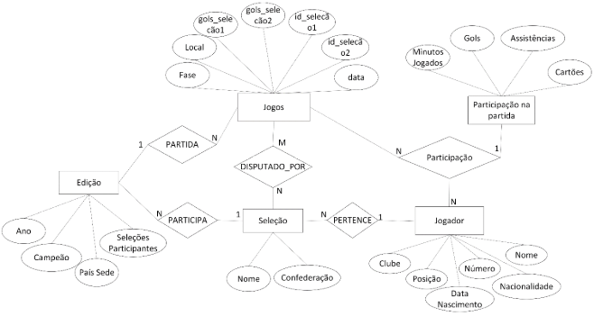


# **Documento de Especificação e Projeto de Banco de Dados**

Título do Projeto: Sistema de Futebol da Copa do Mundo

Disciplina: Banco de dados
Autores:

João Gabriel Abreu Soares

Ícaro Pereira Rosa Alves de Sá

### **Controle de Versão**

|Versão|Data|Autor(es)|` `Descrição da Alteração|
| :- | :- | :- | :- |
|1\.0|26/08|Ícaro Pereira|Versão inicial do documento|
|1\.1|06/10|João Gabriel|Adicionando diagrama MER e dicionário de dados em formato de lista.|

### **Sumário**

1. Introdução\
   1.1. Contexto e Objetivo do Projeto\
   1.2. Escopo
1. Requisitos de Dados\
   2.1. Requisitos Funcionais\
   2.2. Requisitos Não-Funcionais\
   2.2.1. Integridade da Entidade\
   2.2.2. Integridade Referencial\
   2.2.3. Integridade de Domínio\
   2.2.4. Integridade Definida pelo Usuário
1. Projeto Conceitual\
   3.1. Modelo Entidade-Relacionamento (MER)\
   3.2. Dicionário de Dados
1. Projeto Lógico\
   4.1. Mapeamento para o Modelo Relacional\
   4.2. Normalização
1. Implementação\
   5.1. Scripts SQL de Criação (DDL)\
   5.2. Scripts SQL de Manipulação e Consulta (DML/DQL)
1. Conclusão\
   6.1. Considerações Finais\
   6.2. Referências

### **1. Introdução**
####
#### **1.1. Contexto e Objetivo do Projeto**
O presente projeto tem como objetivo descrever e especificar os requisitos de dados para o "Sistema de Futebol da Copa do Mundo". O propósito fundamental é registrar e organizar de forma estruturada as informações históricas das edições da Copa do Mundo da FIFA. O sistema se concentrará em dados relativos a jogadores, seleções, jogos e seus respectivos resultados, permitindo análises detalhadas sobre a história da competição.
#### **1.2. Escopo**

O escopo do sistema abrange o registro histórico de jogos de edições anteriores da Copa do Mundo. Isso inclui:

- O cadastro de edições do torneio, seleções participantes, e jogadores.
- O registro de todos os jogos, com informações de fase, placar, local e data.
- A capacidade de vincular jogadores a jogos para registrar seu desempenho individual (gols, assistências, etc.).
- A geração de relatórios e a derivação de informações consolidadas, como a idade de um jogador em uma partida ou o desempenho de uma seleção em uma edição específica.

### **
### **2. Requisitos de Dados**

#### **2.1. Requisitos Funcionais**
As funcionalidades do sistema que interagem com o banco de dados são as seguintes:

1. **Gerenciamento de Edições e Seleções:**
   1. O sistema deve permitir o cadastro de cada edição da Copa do Mundo, registrando o ano e o país-sede.
   1. Para cada edição, deve ser possível registrar as seleções participantes, incluindo seu nome e a confederação a que pertencem. Uma mesma seleção pode participar de múltiplas edições.
1. **Gerenciamento de Jogadores:**
   1. O sistema deve permitir o cadastro de jogadores, com nome, data de nascimento, nacionalidade, posição e clube em que atuava.
   1. O nome completo e a data de nascimento são suficientes para identificar um jogador de forma única.
   1. A idade do jogador não será armazenada diretamente, mas deve ser calculável a partir de sua data de nascimento.
1. **Registro de Jogos e Participações:**
   1. O sistema deve registrar cada jogo de uma edição, com dados como fase, local, placar e data.
   1. Cada jogo deve estar associado a duas seleções participantes e a uma edição da Copa do Mundo.
   1. A participação de um jogador em um jogo deve ser registrada, incluindo detalhes como gols, assistências, minutos jogados e cartões.
1. **Relatórios e Análise:**
   1. Gerar relatórios que mostrem a média de gols por jogo de uma edição específica.
   1. Listar os 10 jogadores com mais gols e mais assistências em uma única edição.
   1. Calcular o número total de cartões amarelos e vermelhos por confederação.
   1. Gerar um relatório listando todos os jogos de mata-mata que terminaram em empate no tempo normal e o resultado final da partida.
   1. Mostrar quantos jogadores de uma determinada idade participaram de uma edição específica.
   1. Listar os jogadores que participaram de todas as edições da Copa entre dois anos.
####
####
####
#### **2.2. Requisitos Não-Funcionais**

##### **2.2.1. Integridade da Entidade**
- Cada edição da Copa do Mundo deve ser única, identificada pelo seu ano e país-sede.
- A combinação do nome completo e da data de nascimento de um jogador deve ser única no sistema.
- Cada jogo deve possuir um identificador único dentro de uma edição específica do torneio.
##### **2.2.2. Integridade Referencial**

- Um jogo só poderá ser registrado se as duas seleções participantes e a edição da Copa do Mundo correspondente já estiverem cadastradas.
- A participação de um jogador em um jogo só pode ser registrada se tanto o jogador quanto o jogo já existirem no banco de dados.
- A exclusão de uma edição da Copa do Mundo implicará na exclusão de todos os jogos e participações de jogadores associados a ela.
##### **2.2.3. Integridade de Domínio**
- O ano de uma edição da Copa do Mundo deve ser um número inteiro.
- O placar de um jogo deve ser representado por números inteiros não negativos.
- As datas (nascimento e jogo) devem ser válidas, e a data de nascimento de um jogador deve ser sempre anterior à data de um jogo do qual ele participou.
##### **2.2.4. Integridade Definida pelo Usuário**
- Um jogador só pode ser associado a uma seleção em uma edição se ele possuir a mesma nacionalidade da seleção.
- Um jogo só pode ser registrado se as duas seleções participantes forem distintas.
- O campeão de uma edição da Copa do Mundo deve ser, obrigatoriamente, uma das seleções que participaram daquela edição

### **3. Projeto Conceitual**

#### **3.1. Modelo Entidade-Relacionamento (MER)**

#### **3.2. Dicionário de Dados**
### **Entidade: Edição**
- **Ano:**
  - *Descrição:* Ano de realização da edição do torneio.
  - *Tipo de Dado:* Inteiro / Ano
- **Campeão:**
  - *Descrição:* Nome da seleção que venceu a edição.
  - *Tipo de Dado:* Texto
- **País Sede:**
  - *Descrição:* Nome do país que sediou o torneio.
  - *Tipo de Dado:* Texto
- **Seleções Participantes:**
  - *Descrição:* Número total de seleções que participaram da edição.
  - *Tipo de Dado:* Inteiro
### **Entidade: Jogos**
- **id\_jogo (Chave Primária):**
  - *Descrição:* Identificador único para cada jogo. (Inferido pela necessidade de uma chave)
  - *Tipo de Dado:* Inteiro / Autoincremento
- **data:**
  - *Descrição:* Data em que o jogo foi realizado.
  - *Tipo de Dado:* Data
- **Fase:**
  - *Descrição:* Fase do torneio a que o jogo pertence (ex: Fase de Grupos, Oitavas de Final).
  - *Tipo de Dado:* Texto
- **Local:**
  - *Descrição:* Estádio ou cidade onde o jogo foi disputado.
  - *Tipo de Dado:* Texto
- **id\_selecao1 (Chave Estrangeira):**
  - *Descrição:* Identificador da primeira seleção que disputou o jogo.
  - *Tipo de Dado:* Inteiro
- **id\_selecao2 (Chave Estrangeira):**
  - *Descrição:* Identificador da segunda seleção que disputou o jogo.
  - *Tipo de Dado:* Inteiro
- **gols\_selecao1:**
  - *Descrição:* Número de gols marcados pela primeira seleção.
  - *Tipo de Dado:* Inteiro
- **gols\_selecao2:**
  - *Descrição:* Número de gols marcados pela segunda seleção.
  - *Tipo de Dado:* Inteiro
### **Entidade: Seleção**
- **id\_selecao (Chave Primária):**
  - *Descrição:* Identificador único para cada seleção. (Inferido pela necessidade de uma chave)
  - *Tipo de Dado:* Inteiro / Autoincremento
- **Nome:**
  - *Descrição:* Nome da seleção (país).
  - *Tipo de Dado:* Texto
- **Confederação:**
  - *Descrição:* Confederação à qual a seleção pertence (ex: CONMEBOL, UEFA).
  - *Tipo de Dado:* Texto
### **Entidade: Jogador**
- **id\_jogador (Chave Primária):**
  - *Descrição:* Identificador único para cada jogador. (Inferido pela necessidade de uma chave)
  - *Tipo de Dado:* Inteiro / Autoincremento
- **Nome:**
  - *Descrição:* Nome completo do jogador.
  - *Tipo de Dado:* Texto
- **Data Nascimento:**
  - *Descrição:* Data de nascimento do jogador.
  - *Tipo de Dado:* Data
- **Posição:**
  - *Descrição:* Posição principal em que o jogador atua (ex: Atacante, Goleiro).
  - *Tipo de Dado:* Texto
- **Clube:**
  - *Descrição:* Clube onde o jogador atuava durante o torneio.
  - *Tipo de Dado:* Texto
- **Nacionalidade:**
  - *Descrição:* Nacionalidade do jogador.
  - *Tipo de Dado:* Texto
- **Número:**
  - *Descrição:* Número da camisa do jogador na seleção.
  - *Tipo de Dado:* Inteiro
- **id\_selecao (Chave Estrangeira):**
  - *Descrição:* Identificador da seleção à qual o jogador pertence.
  - *Tipo de Dado:* Inteiro
### **Entidade Associativa: Participação na partida**
Esta entidade é formada pela relação N:N entre Jogador e Jogos.

- **id\_jogo (Chave Estrangeira):**
  - *Descrição:* Identificador do jogo em que o jogador participou.
  - *Tipo de Dado:* Inteiro
- **id\_jogador (Chave Estrangeira):**
  - *Descrição:* Identificador do jogador que participou do jogo.
  - *Tipo de Dado:* Inteiro
- **Minutos Jogados:**
  - *Descrição:* Quantidade de minutos que o jogador esteve em campo.
  - *Tipo de Dado:* Inteiro
- **Gols:**
  - *Descrição:* Número de gols marcados pelo jogador na partida.
  - *Tipo de Dado:* Inteiro
- **Assistências:**
  - *Descrição:* Número de assistências para gol feitas pelo jogador na partida.
  - *Tipo de Dado:* Inteiro
- **Cartões:**
  - *Descrição:* Cartões recebidos pelo jogador (ex: Amarelo, Vermelho).
  - *Tipo de Dado:* Texto / Inteiro (codificado)
### **4. Projeto Lógico**

#### **4.1. Mapeamento para o Modelo Relacional**

[Mostre a estrutura das tabelas do modelo relacional, com as chaves primárias e estrangeiras identificadas. Exemplo abaixo.]

Livro (<u>ISBN</u>, Título, Ano, Código\_Autor)

Autor (<u>Código\_Autor</u>, Nome)

#### **4.2. Normalização**

[Explique a aplicação das formas normais (1FN, 2FN, 3FN) no projeto, justificando como as tabelas foram projetadas para evitar redundâncias.]

### **5. Implementação**

#### **5.1. Scripts SQL de Criação (DDL)**

[Inclua o código SQL completo para a criação de todas as tabelas. O código deve ser executável.]

SQL

CREATE TABLE Autor (\
`    `codigo\_autor INT PRIMARY KEY,\
`    `nome VARCHAR(255) NOT NULL\
);\
\
CREATE TABLE Livro (\
`    `isbn VARCHAR(13) PRIMARY KEY,\
`    `titulo VARCHAR(255) NOT NULL,\
`    `ano INT,\
`    `codigo\_autor INT,\
`    `FOREIGN KEY (codigo\_autor) REFERENCES Autor(codigo\_autor)\
);

#### **5.2. Scripts SQL de Manipulação e Consulta (DML/DQL)**

[Apresente consultas SQL variadas que demonstrem a funcionalidade do sistema. Explique cada consulta com um breve comentário.]

SQL

-- Consulta 1: Listar todos os livros com seus autores\
SELECT T1.titulo, T2.nome\
FROM Livro AS T1\
JOIN Autor AS T2 ON T1.codigo\_autor = T2.codigo\_autor;\
\
-- Consulta 2: Contar quantos livros um autor específico possui\
SELECT COUNT(T1.isbn)\
FROM Livro AS T1\
JOIN Autor AS T2 ON T1.codigo\_autor = T2.codigo\_autor\
WHERE T2.nome = 'Autor Exemplo';

### **6. Conclusão**

#### **6.1. Considerações Finais**

[Faça uma reflexão sobre a experiência de desenvolver o projeto, os desafios superados e os principais aprendizados.]

### **7. Referências**

[Liste as fontes de pesquisa, como livros, artigos ou sites, se aplicável.]
